# 总体流程

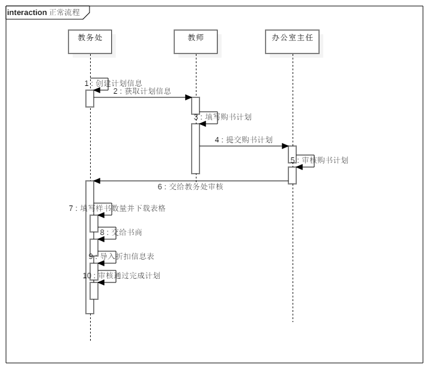

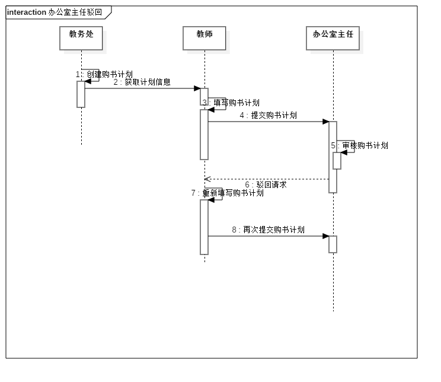

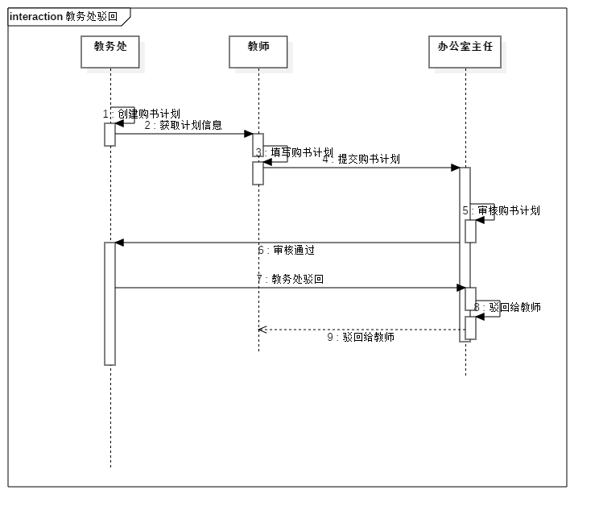

# 教务处

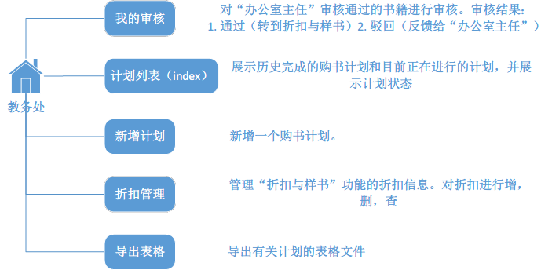

## 新增计划

1. 教务处填写购书计划**元信息**（学年；学期；学院；教育层次【本科/高职等等】）。
2. 上传系统提供的并由教务处教师填写完成的购书计划Excel表格。
3. 完成购书计划的创建。

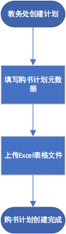

## 我的审核

> 对“办公室主任”审核通过的书籍进行审核。审核结果：
>
> 1. 通过（转到折扣与样书）
> 2. 驳回（反馈给“办公室主任”）

1. 教务处可以通过下拉列表选择某个购书计划（下拉列表中购书计划只展示状态是未完成的），默认展示最新创建的购书计划。
2. 当教务处选择下拉列表中某个购书计划时，将以表格的形式在网页上展示”办公室主任“审核通过的教师购书列表。
3. 教务处可以对某本书（下文用书A代替）进行驳回操作（驳回时必须填写驳回原因），该操作导致书A返回至“办公室主任”处，并且书A在教师购书列表的状态更改为“教务处驳回”。
4. 教务处可以对书籍进行一键审核通过操作（该操作不会影响已经驳回的书籍状态）。
5. 审核通过的书籍将在“折扣与样书”页面填写折扣信息和教务处订购样书数量信息。

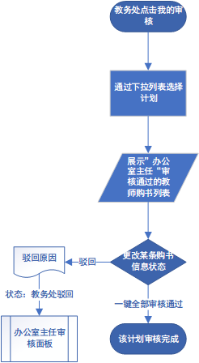

**教师购书列表表头**：

- 课程名称
- 书籍编号
- 书籍名称
- 教材类别
- 出版社
- 作者
- 价格
- 样书数量
- 获奖信息和丛书名称
- 出版日期
- 教材计划征订单提交人联系电话
- 审核状态（通过/已驳回/未审核）

**教师购书列表展示细节**：

- 分页：

  默认10页每条，可更改。提供直接跳转到某页功能。

- 展示：

  默认展示优先级：已驳回>未审核（优先展示未定书）>通过

## 计划列表

> 展示历史完成的购书计划和目前正在进行的计划，并展示计划状态

- 计划列表可以通过【全部/进行中/已完成】三个过滤条件进行过滤（默认展示全部计划）。
- 默认最新创建的计划将排在首位，进行中的排在第二位，已完成的计划排在末尾。
- 分页：默认每页10条数据，可更改。提供快速跳转到某页功能。
- 每条数据展示：
  - 计划所属学年学期学院教育层次
  - 计划当前状态（已创建/审核中/已完成）
  - 编辑该计划（已完成的计划无法编辑）
  - 下载上传该计划的Excel文件
  - 删除某个计划
  - 计划创建时间/完成时间

**数据展示细节**：

- 编辑该计划
  1. 进入编辑页面，可以更改计划的元数据（学年；学期；学院；教育层次【本科/高职等等】）。
  2. **无法更改模板excel信息（可以将计划删除重新创建）。**
  3. 保存后更改立即生效。

- 删除某个计划
  1. 提示确认删除计划（**如果计划的状态是审核中则再增加一次删除警告提醒**）。
  2. 确认删除后即刻删除该计划。

## 折扣管理

> 管理“折扣与样书”功能的折扣信息。对折扣进行增，删，查

- 教务处可以查看当前创建的折扣列表

- 可以对某个折扣条目进行删除操作

  删除时将进行删除确认

- 新增某个折扣条目

  新增的折扣信息必须是**整数**或**小数**

  重复的折扣信息将不予新增

## 折扣与样书

> 在“我的审核”中审核通过后进行折扣和教务处购买样书的数量进行登记

1. 教务处可以通过下拉列表选择某个购书计划（下拉列表中购书计划只展示状态是未完成的），默认展示最新创建的购书计划。
2. 选择某个购书计划后，将展示教务处审核通过的购书信息。
3. 可以设置某本书的**教务处样书数量**
4. 可以设置某本书的**折扣信息**（提供下拉列表，下拉列表数据通过“折扣管理”进行管理）
5. 可以批量设置某些书的折扣信息
6. 信息填写完成后进行提交操作

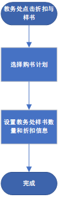

**展示细节**：

- 分页：

  默认10页每条，可更改。提供直接跳转到某页功能。

- 展示列表表头：

  - 课程名称
  - 书籍编号
  - 书籍名称
  - 教材类别
  - 出版社
  - 作者
  - 价格
  - 样书数量
  - 获奖信息和丛书名称
  - 出版日期
  - 教材计划征订单提交人联系电话
  - 折扣信息
  - 教务处样书数量

## 导出表格

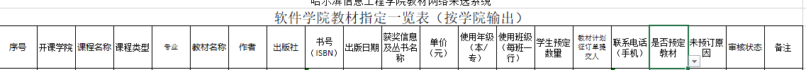

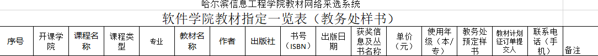

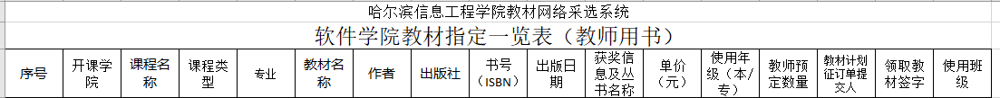

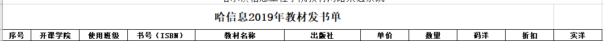

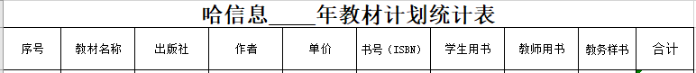

# 办公室主任

## 我的审核

> 审核“教师”提交的购书信息。
> 审核结果：1. 通过（转给教务处）2. 驳回（转给教师）

1. 办公室主任可以通过下拉列表选择某个购书计划（下拉列表中购书计划只展示状态是未完成的），默认展示最新创建的购书计划。
2. 当办公室主任选择下拉列表中某个购书计划时，将以表格的形式在网页上展示教师购书列表。
3. 办公室主任可以对某本书（下文用书A代替）进行驳回操作（驳回时必须填写驳回原因），该操作导致书A返回至“教师”处，并且书A在教师购书列表的状态更改为“办公室主任驳回”。
4. 办公室主任可以对书籍进行一键审核通过操作（该操作不会影响已经驳回的书籍状态）。
5. 审核通过的书籍将在教务处“我的审核”页面进行教务处审核操作。
6. 教务处驳回的书籍信息可以通过驳回操作驳回给教师，并可以修改驳回原因。
7. 已被教务处驳回的书籍信息无法立即审核通过，即只能驳回给教师后教师重新提交。

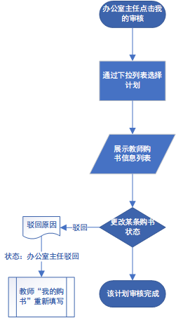

**教师购书列表表头**：

- 课程名称
- 书籍编号
- 书籍名称
- 教材类别
- 出版社
- 作者
- 价格
- 样书数量
- 获奖信息和丛书名称
- 出版日期
- 教材计划征订单提交人联系电话
- 审核状态（通过/已驳回/未审核）

**教师购书列表展示细节**：

- 分页：

  默认10页每条，可更改。提供直接跳转到某页功能。

- 展示：

  默认展示优先级：教务处驳回>已驳回>未审核（优先展示未定书）>通过

# 教师

## 我的购书

> 按学期/学年查看教师购书列表，默认展示本次购书列表，并包含图书审核状态

1. 教师通过下拉列表选择购书计划（只展示未完成的计划）。
2. 选择后，将以表格的形式展示教师已填写的购书信息。
3. 每条购书信息包含书籍审核状态（审核中/已审核/办公室主任驳回）。
4. 如果有驳回状态的书籍，教师可以将该书集修改重新提交审核。

**展示细节**：

- 分页：

  默认10页每条，可更改。提供直接跳转到某页功能。

- 展示列表表头：

  - 课程名称
  - 书籍编号
  - 书籍名称
  - 教材类别
  - 出版社
  - 作者
  - 价格
  - 样书数量
  - 获奖信息和丛书名称
  - 出版日期
  - 教材计划征订单提交人联系电话
  - 书籍状态（审核中/已审核/办公室主任驳回）

## 填写购书信息

1. 教师选择课程名称，是否购书。
2. 如果选择无需购书，填写原因，表单其他项目均无需填写。
3. 教师通过表单的形式填写书籍信息。
4. 教师可以重复选择某门课程的书籍（即ISBN如果不相同则认为该门课程有多本书籍）。
5. 当ISBN和课程名称重复时将不予提交。

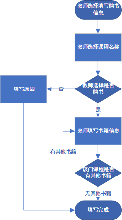

表单细节：

- 是否购书（选择“否”必须填写原因）

- 课程名称
- 书籍编号
- 书籍名称
- 教材类别
- 出版社
- 作者
- 价格
- 样书数量
- 获奖信息和丛书名称
- 出版日期
- 教材计划征订单提交人联系电话
